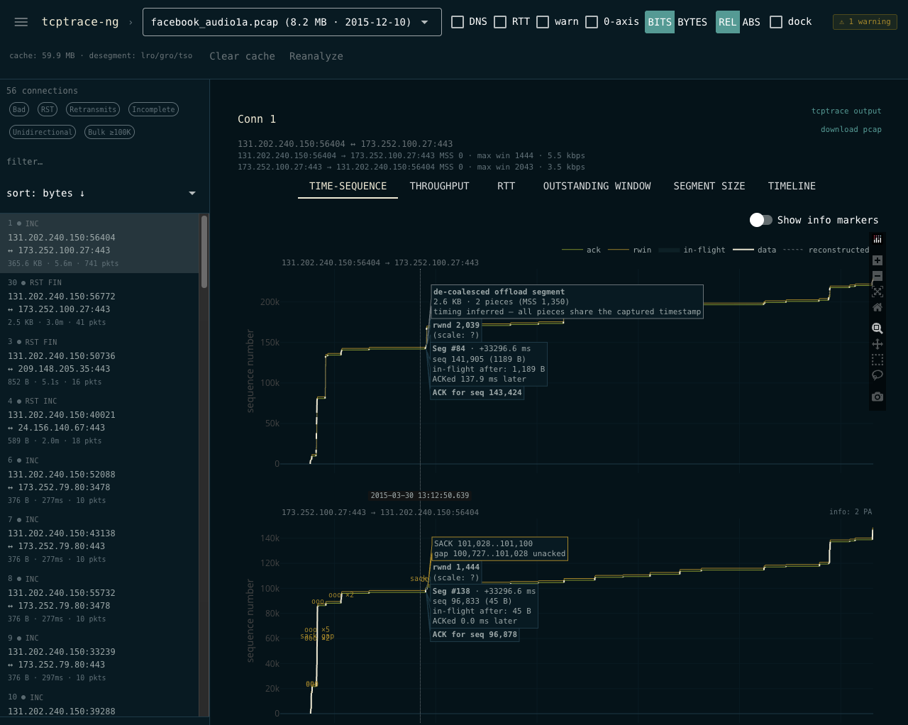

# tcptrace-ng

Local web UI for [tcptrace](https://github.com/blitz/tcptrace) pcap analysis, with interactive in-browser graphs.



## Quickstart

```bash
# 1. Get a tcptrace binary — pick one:
git clone --recurse-submodules https://github.com/phreakocious/tcptrace-ng.git && cd tcptrace-ng && make vendor-tcptrace
# or: brew install tcptrace            # macOS
# or: apt install tcptrace             # Debian/Ubuntu

# 2. Install tcptrace-ng
pip install -e ".[dev]"
# or: uv pip install -e ".[dev]"

# 3. Run it in a directory of pcaps
cd /path/with/pcaps
tcptrace-ng
```

A browser opens to a local NiceGUI page laid out as a top bar + sidebar + main panel. Pick a pcap in the header; the sidebar fills with that pcap's connections (filterable). Click any connection to analyze it on the spot. The main panel shows:

- One tab per generated `.xpl` graph (time-sequence, throughput, RTT, owin, ssize), rendered as interactive Plotly charts with pan/zoom.
- A **tcptrace output** button (top-right) opens the raw color-coded analysis in a modal (green = good, yellow = interesting, red = bad).
- Header checkboxes toggle common tcptrace flags — **DNS** (opt-in, off by default → adds `-n` to skip hostname/port resolution), **RTT** (`-r`), **warn** (`-w`), **csum** (`--checksum --warn_printbadcsum` to verify and surface bad IP/TCP checksums — useful for catching NIC offload artifacts), **0-axis** (`-zx`). Toggling re-runs analysis and busts the cache for that flag combo.
- A `⚠ N warnings` chip appears in the header when the pre-flight scan flags conditions that distort analysis. Currently detects NIC offload (LSO/GSO/TSO/LRO/GRO) — when the capture shows TCP segments larger than 1500 B, the captured MSS, time-sequence staircases, and retransmit detection are all unreliable. Click for full text.

### Tunnel decapsulation

tcptrace doesn't know about modern overlay encapsulations, so any flow wrapped in **Geneve** (UDP/6081), **VXLAN** (UDP/4789), or **GRE** (IP protocol 47) is invisible to it. tcptrace-ng auto-detects these in the first ~200 frames; if any are present, it rewrites the pcap once (stripping outer headers) and feeds the decapsulated copy to tcptrace. The decap'd pcap is cached at `.tcptrace/<pcap>/decap.pcap`. The header shows `decap: geneve` (or `vxlan+gre`, etc.) when a decap pass ran.

Bare-IP inners (common with GRE) get a synthetic Ethernet header so the output stays DLT_EN10MB. IPv6 extension headers (HBH/routing/destination/fragment) are already handled natively by tcptrace's `ipv6.c`.

Click another connection to swap the view --- already-analyzed connections render instantly from cache. The sidebar footer has a "↓ xpl zip" button that bundles every connection you've analyzed in this session, in case you still want to view them in desktop `xplot`/`jplot`.

## Caching

Per-pcap caches live in `.tcptrace/<pcap-name>/` next to each pcap. The header shows total cache size. **Clear cache** wipes everything; **Reanalyze** wipes just the current pcap's cache.

Add `.tcptrace/` to your `.gitignore`.

## CLI options

```
tcptrace-ng [DIR]
  --port PORT          bind port (default: pick free)
  --no-browser         don't auto-open browser
  --timeout SECONDS    per-subprocess timeout (default: 60)
  --debug              verbose logs
  -V, --version
```

## Vendored tcptrace

Upstream tcptrace ([tcptrace.org](http://tcptrace.org)) hasn't been touched since 2006; its TLS cert is expired and the source no longer builds on modern toolchains. [github.com/blitz/tcptrace](https://github.com/blitz/tcptrace) is the practical canonical source — it's what the FreeBSD port and Homebrew formula track. tcptrace-ng vendors a fork of that at `vendor/tcptrace` (submodule → [phreakocious/tcptrace](https://github.com/phreakocious/tcptrace)) with two build fixes for modern macOS/Linux toolchains:

- `mod_traffic.c`: silenced an unused-return-value warning that `-Wreturn-type` now fails on.
- `tcpdump.c`: replaced the private `pcap_offline_read()` (removed in modern libpcap) with `pcap_dispatch()` — [msagarpatel's 2021 Ubuntu fix](https://github.com/blitz/tcptrace/pull/9).

```bash
git submodule update --init    # if you didn't clone with --recurse-submodules
make vendor-tcptrace           # configure + build → vendor/tcptrace/tcptrace
```

The runner resolves the binary in this order: `$TCPTRACE_BIN` (if set) → `vendor/tcptrace/tcptrace` (if built) → first `tcptrace` on `$PATH`. Installed wheels skip the vendored copy and fall back to `$PATH`.

## Development

```bash
uv venv && source .venv/bin/activate
uv pip install -e ".[dev]"
pytest -q                # unit tests
ruff check src tests     # lint
ruff format src tests    # format
```

## Optional dependencies

For non-pcap captures (e.g., `.cap` from older tools), install the Wireshark CLI tools (`capinfos`, `editcap`). tcptrace-ng will run them automatically as a fallback.
